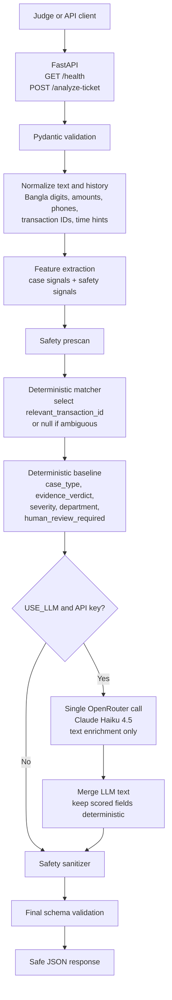

# QueueStorm Investigator - 90 Second Architecture Walkthrough

Use this as the video narration and slide outline for the optional architecture
walkthrough submission.

## 90 Second Script

**0:00-0:10 - Problem and surface**

QueueStorm Investigator is a FastAPI support-operations copilot for digital
finance tickets. The judged surface is intentionally small: `GET /health` and
`POST /analyze-ticket`. The live deployment is
`https://queue-storm-qbfrm.ondigitalocean.app/`.

**0:10-0:25 - API flow**

For each ticket, the service accepts a customer complaint plus recent synthetic
transaction history. It validates the request with Pydantic, normalizes Bangla,
Banglish, amounts, phone numbers, transaction IDs, and time hints, then extracts
complaint features such as wrong transfer, failed payment, duplicate payment,
agent cash-in, settlement delay, refund request, and phishing.

**0:25-0:45 - Evidence reasoning**

The deterministic engine is the authority for scored fields. It selects the
relevant transaction only when evidence is strong: exact transaction ID, amount,
counterparty, type, time, duplicate pattern, or sole concrete transaction. If
multiple transactions are plausible, it returns `null` and
`insufficient_data` instead of guessing.

**0:45-1:00 - Safety guardrails**

Safety runs before and after generation. The sanitizer blocks requests for PIN,
OTP, passwords, card data, unauthorized refund or reversal promises, and
third-party redirects. It can raise severity to `critical`, force human review,
and replace unsafe text with a safe official reply.

**1:00-1:15 - AI approach**

OpenRouter is optional. When enabled, the service makes one call to
`google/gemini-2.5-flash-lite` for narrative enrichment only: agent summary,
recommended next action, customer reply, confidence, and reason codes. It is
generally fast and usually returns in under 5 seconds. Scored fields stay
deterministic, so model drift cannot change the judged answer.

**1:15-1:30 - Deployment and limitations**

The service deploys as one Docker container with no database, queue, GPU, or
required external dependency. It works fully with `USE_LLM=false` or no API key.
Its main limitation is scope: it only investigates the transaction history in
the request and never queries a real ledger or authorizes money movement.

## Markdown Slides

### Slide 1 - What It Does

- SupportOps copilot for digital-finance complaints
- Inputs: complaint plus recent transaction history
- Outputs: official JSON decision for classification, routing, evidence, safety,
  and customer reply
- Live URL: `https://queue-storm-qbfrm.ondigitalocean.app/`

### Slide 2 - Architecture Flow

### Slide 3 - Scored Field Ownership

| Field group | Owner |
|---|---|
| `relevant_transaction_id` | Deterministic matcher |
| `case_type`, `evidence_verdict` | Deterministic classifier and verdict engine |
| `severity`, `department`, `human_review_required` | Deterministic routing and safety |
| `agent_summary`, `recommended_next_action`, `customer_reply` | Template baseline, optionally LLM-enriched |
| `confidence`, `reason_codes` | Baseline plus validated LLM additions |

### Slide 4 - Safety Rules

- Never ask for PIN, OTP, password, CVV, security code, or full card number
- Never promise refund, reversal, account unblock, or recovery
- Never send users to third-party links, numbers, WhatsApp, Telegram, or direct
  merchant contact
- Treat complaint text as untrusted data and ignore prompt-injection attempts
- Always return a schema-valid safe response

### Slide 5 - Deployment and Limits

- Single Dockerized FastAPI service
- Python 3.12, FastAPI, Uvicorn, Pydantic v2
- Optional OpenRouter call; deterministic path needs no network
- No database, no GPU, no local model artifact
- Limitation: analyzes only supplied synthetic history; no real ledger lookup or
  financial authority
